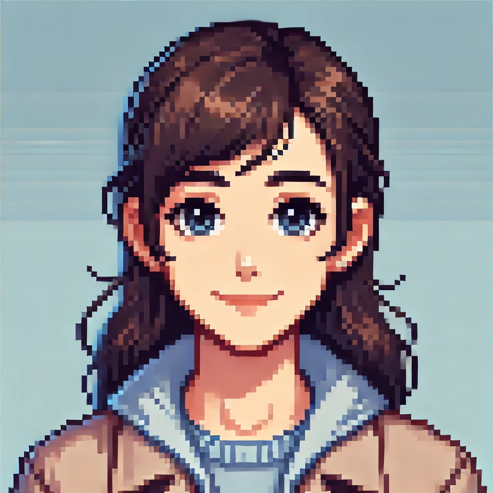
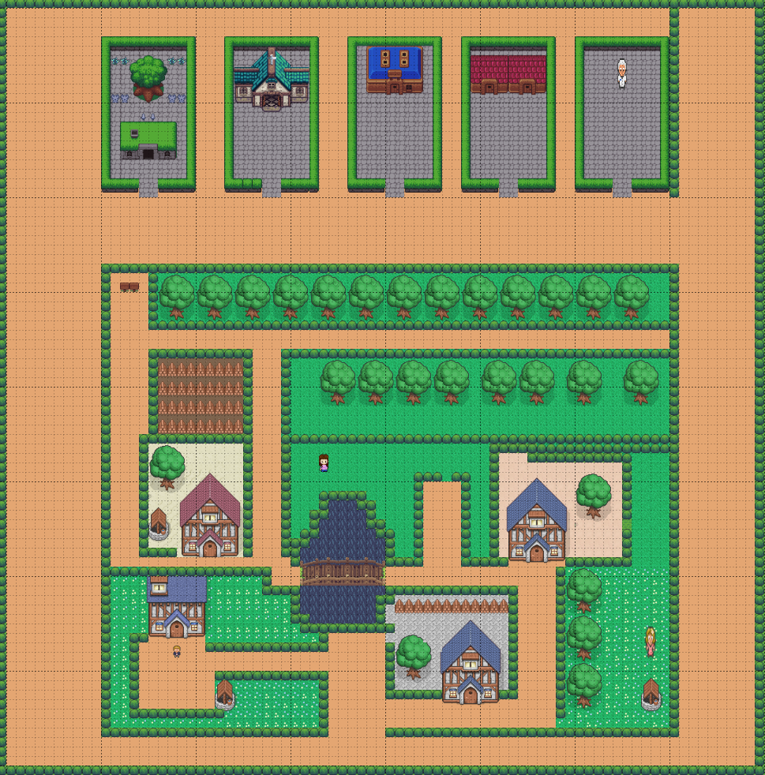
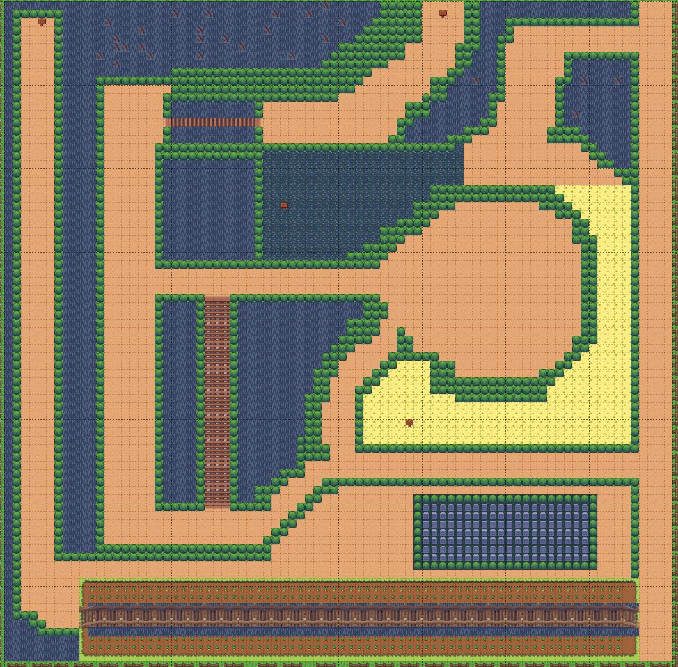
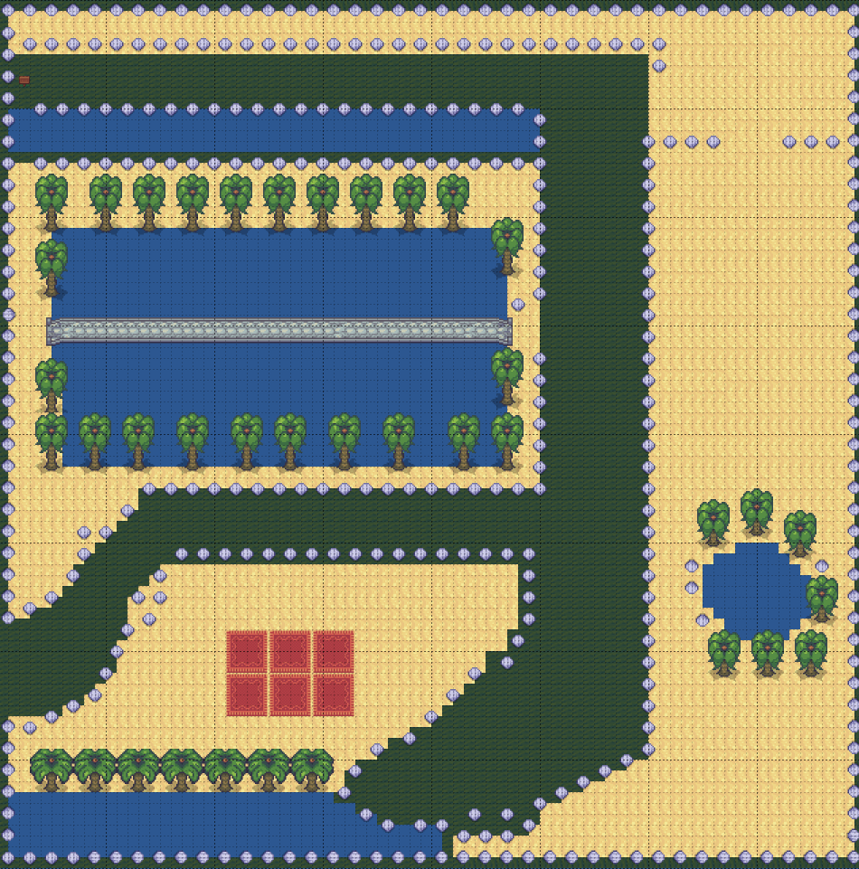
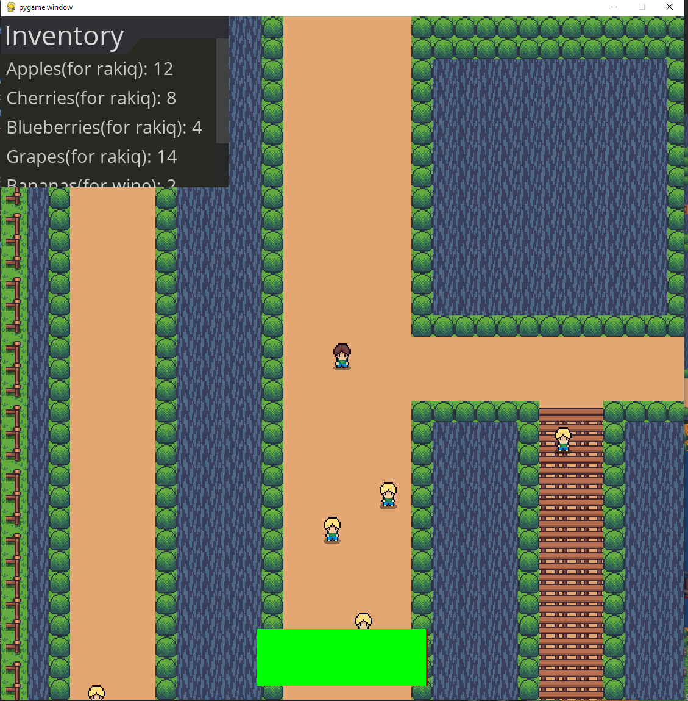
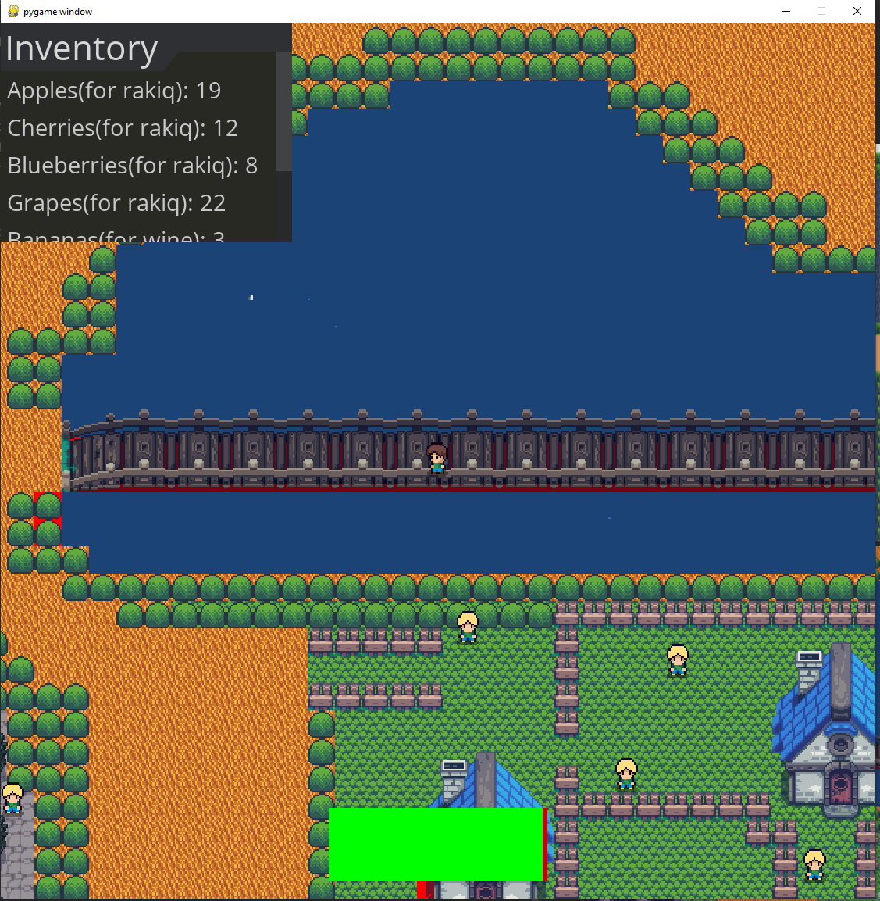

# Secret of Spas

## 📖 Description
Secret of Spas is a single-player RPG that unfolds in the quiet village of Mogilovo.

Spas, an old man known for his love of drinking, wakes up to a terrible discovery—his precious stash of alcohol has been stolen. Desperate to recover it, he enlists the help of Kuncho, a spirited 20-year-old from the village.

Spas makes Kuncho an intriguing offer: if he can track down the thief and reclaim the stolen stash, he will reveal to him the ultimate secret of life.

Now, it’s up to Kuncho to embark on this unusual quest, uncovering mysteries and facing unexpected challenges along the way.

## 📖 Missions
Every mission is given from someone who is called `snitch`
`Snitch` is a npc who knows some information for the burgler
but the snitch wants something in return from Kuncho
Every snitch gives mission on only one game map
##### 4 mission snitches
- ### `Spas`
    - 
- ### `Vladi`
    
- ### `Vili`
   
- ### `Eva`
  

## 📖 Game Maps
- ### `Village`

    - 
- ### `Rakiq map`
-  
- ### `Gin map`
- 
- ### `Wine map`
- 

## 📖 Enemies
### There are 2 types of enemies
- Infantry
- Archers

## Gameplay Screenshots
- 
- 
