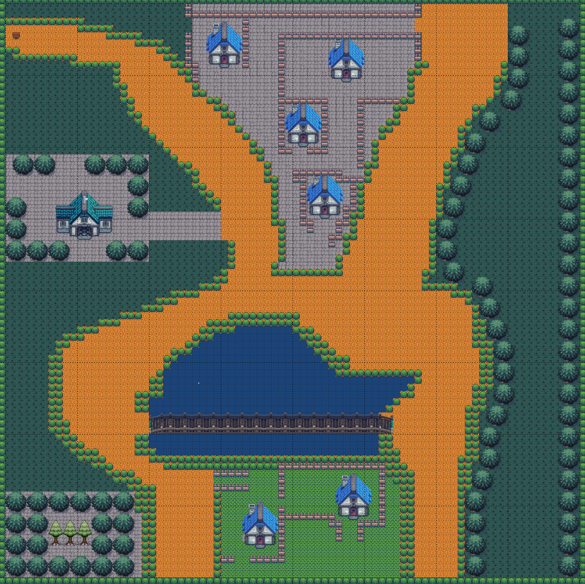

# Secret of Spas

## 📖 Description
Secret of Spas is single player RPG game which follows a story:
An old name named Spas is a heavy drinker in the small village Mogilovo
He very likes to drink but someone has stolen his alcohol stash
So in help comes Kuncho who is young boy(20 year old) from the village
Spas tells Kuncho that if he retrieves his alcohol stash from the burgler
He will tell him the secret of life
So it is Kuncho's responsibility to find the stash.

## 📖 Missions
Every mission is given from someone who is called `snitch`
`Snitch` is a npc who knows some information for the burgler
but the snitch wants something in return from Kuncho
Every snitch gives mission on only one game map
##### 4 mission snitches
- ### `Spas`
    - 
- ### `Vladi`
    
- ### `Vili`
   
- ### `Eva`
  

## 📖 Game Maps
- ### `Village`

    - 
- ### `Rakiq map`
-  
- ### `Gin map`
- 
- ### `Wine map`
- 

## 📖 Enemies
### There are 2 types of enemies
- Infantry
- Archers

## Gameplay Screenshots
- 
- 
